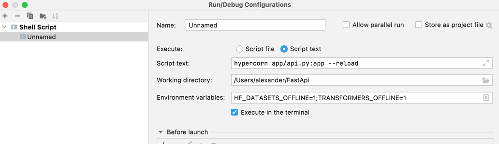

# FastApi

This example uses FastAPI - one of the fastest Python frameworks available.
[FastAPI Official site](https://fastapi.tiangolo.com/)

## Prerequisites

Install requirements using the package manager [pip](https://pip.pypa.io/en/stable/).

```bash
pip install -r requirements.txt
```
Initialize migration using alembic
```bash
cd app
alembic init
alembic revision -m "init"
alembic upgrade head
alembic revision -m "users and items" --autogenerate
alembic upgrade head
```

Or just run the following command once if you have alembic installed and versions of migrations seems to be updated so that you migrate database to create a local sqlite db
```bash
cd app
alembic upgrade head
```

## Running the app
To run the Application you have to use [Gunicorn](https://gunicorn.org)(ASGI)-compatible web-server. (Gunicorn is a Python WSGI HTTP Server for UNIX)

[Hypercorn](https://pgjones.gitlab.io/hypercorn/) is used in below example

Make sure you are at root directory of the app and seeing something like this

`~/FastApi$`
```bash
hypercorn app/api.py:app --reload
```
Or you can use Intellij (Pycharm) to run the app


## Swagger UI available at
`http://localhost:8000/docs`

Transformers models are available at [Hugging Face site](https://huggingface.co/models)
